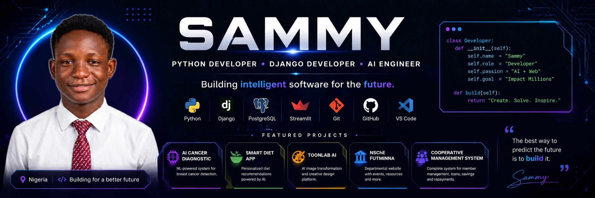

<p align="center">
  
</p>

<h1 align="center">Hi 👋, I'm Sammy</h1>

<h3 align="center">
Python Developer • Django Developer • AI & Machine Learning Enthusiast
</h3>

<p align="center">
I enjoy building intelligent software that solves real-world problems using Python, Django, Machine Learning, and Data Science.
</p>

<p align="center">

<a href="https://github.com/sammy001-cmd">

</a>


</p>

---

# 👨🏽‍💻 About Me

```python
class Sammy:

    def __init__(self):

        self.name = "Sammy"

        self.role = [
            "Python Developer",
            "Django Developer",
            "Machine Learning Enthusiast"
        ]

        self.current_projects = [
            "AI Cancer Diagnostic",
            "Smart Diet Recommendation",
            "NSChE FUTMINNA Website",
            "ToonLab AI"
        ]

        self.learning = [
            "Deep Learning",
            "Computer Vision",
            "Cloud Deployment"
        ]

    def motto(self):
        return "Create • Learn • Impact"
```

---

# 🚀 Tech Stack

### Languages

<p>


</p>

### Frameworks

<p>


</p>

### Database

<p>


</p>

### Tools

<p>


</p>

### AI / Data Science

- Pandas
- NumPy
- Scikit-Learn
- Matplotlib
- Streamlit

---

# 🌟 Featured Projects

## 🤖 AI Cancer Diagnostic


AI-powered breast cancer diagnosis system using Machine Learning.

---

## 🥗 Smart Diet Recommendation


A personalized AI-powered diet recommendation platform.

---

## 🎨 ToonLab AI


AI-powered image transformation application.

---

## 🏫 NSChE FUTMINNA Website


A complete departmental website developed with Django.

---

## 🤝 Cooperative Management System


A digital cooperative platform for savings, loans, and administration.

---

# 📊 GitHub Statistics

<p align="center">


</p>

---

# 🔥 GitHub Streak

<p align="center">


</p>

---

# 🏆 GitHub Trophies

<p align="center">


</p>

---

# 📈 Activity Graph

<p align="center">


</p>

---

# 🎯 Currently Working On

- 🤖 Artificial Intelligence
- 🧠 Machine Learning
- 🌐 Django Web Applications
- ☁️ Cloud Deployment
- 📊 Data Science
- 🏗️ Building production-ready software

---

# 🌱 2026 Goals

- Build impactful AI products
- Contribute to Open Source
- Master Deep Learning
- Become a Full-Stack AI Engineer
- Collaborate on global software projects

---

# 📫 Connect With Me

<p>

<a href="https://github.com/YOUR_USERNAME">

</a>

<a href="YOUR_LINKEDIN">

</a>

<a href="mailto:YOUR_EMAIL">

</a>

<a href="https://sammy-studio.vercel.app/">

</a>

</p>

---

# 💭 Quote

> *"I don't just write code. I build solutions that make a difference."*

---

<p align="center">

### ⭐ Thanks for visiting my profile!

If you enjoy my projects, consider giving them a ⭐ and following my journey.

</p>
